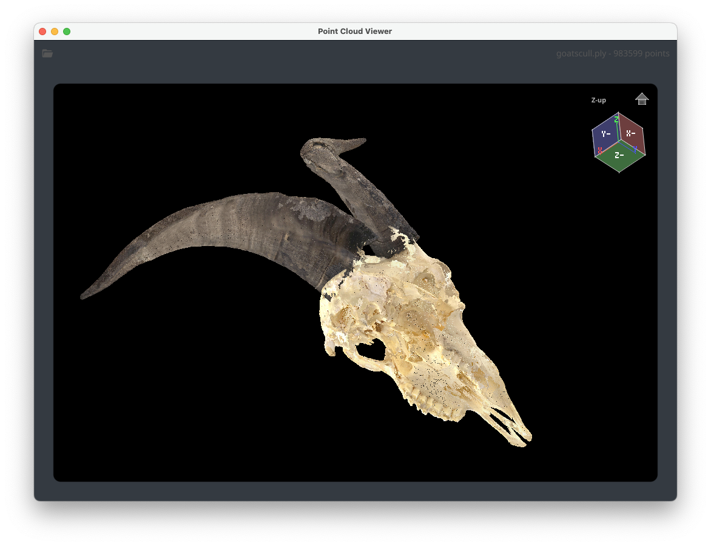

# Point Cloud Viewer

[](https://pkg.go.dev/github.com/borud/pointcloud)

A simple point cloud viewer built with [Fyne](https://fyne.io/) and OpenGL. Reads PLY, PCD, PTS, and XYZ files and renders them as interactive 3D point clouds with mouse-controlled rotation and zoom.



## Features

- Supports PLY, PCD, PTS, and XYZ point cloud formats
- Interactive arcball rotation, panning (Shift+drag), and scroll-wheel zoom
- Orientation cube with click-to-snap face selection
- Home view and zoom-to-fit buttons
- Point picking with coordinate and RGB display
- Scale bar with configurable units
- FPS counter overlay
- Level-of-detail (LOD) decimation during interaction
- Y-up and Z-up coordinate system support
- Keyboard shortcuts: `h` (home), `f` (fit), `+`/`-` (zoom), arrow keys (rotate)

## Installation

```sh
go get github.com/borud/pointcloud
```

## Using the widget

The `Viewer` is a standard Fyne widget that you can embed in any Fyne application. It uses a functional options pattern for configuration.

### Minimal example

```go
package main

import (
 "log"

 "fyne.io/fyne/v2/app"
 "github.com/borud/pointcloud"
)

func main() {
 myApp := app.New()
 w := myApp.NewWindow("Point Cloud")

 v := pointcloud.New()

 pc, err := pointcloud.ReadFile("model.ply")
 if err != nil {
  log.Fatal(err)
 }
 pc.Normalize()
 v.SetScale(pc.NormScale)
 v.SetPoints(pc.Points)

 w.SetContent(v)
 w.ShowAndRun()
}
```

### Configuring the viewer with options

Use functional options to customize appearance when creating the viewer.

```go
v := pointcloud.New(
 pointcloud.WithBackgroundColor(color.RGBA{30, 30, 30, 255}),
 pointcloud.WithDefaultPointColor(color.RGBA{255, 150, 255, 255}),
 pointcloud.WithOrientationCube(true),
 pointcloud.WithHomeButton(true),
 pointcloud.WithZoomFitButton(true),
 pointcloud.WithInfoLabel(true),
 pointcloud.WithScaleBar(true),
 pointcloud.WithScaleUnit("m"),
 pointcloud.WithFPS(true),
 pointcloud.WithMaxZoomOutFraction(0.3),
)
v.SetUpAxis(pointcloud.ZUp)
```

### Loading from an io.Reader

Each format has a dedicated reader function that accepts an `io.Reader`, and there is a `ReadFile` convenience function that auto-detects the format from the file extension.

```go
// Auto-detect format from file extension.
pc, err := pointcloud.ReadFile("scan.pcd")

// Or read a specific format from any io.Reader.
f, _ := os.Open("scan.ply")
defer f.Close()
pc, err := pointcloud.ReadPLY(f)
```

Available readers: `ReadPLY`, `ReadPCD`, `ReadPTS`, `ReadXYZ`.

### Working with point data directly

You can construct a `PointCloud` programmatically instead of reading from a file.

```go
pc := &pointcloud.PointCloud{
 Points: []pointcloud.Point3D{
  {X: 0, Y: 0, Z: 0, R: 255, G: 0, B: 0, HasColor: true},
  {X: 1, Y: 0, Z: 0, R: 0, G: 255, B: 0, HasColor: true},
  {X: 0, Y: 1, Z: 0, R: 0, G: 0, B: 255, HasColor: true},
  {X: 0, Y: 0, Z: 1, R: 255, G: 255, B: 0, HasColor: true},
 },
}
pc.ComputeBounds()
pc.Normalize()

v := pointcloud.New()
v.SetScale(pc.NormScale)
v.SetPoints(pc.Points)
```

### Updating points without resetting the view

Use `SetPointsPreserveView` to replace the displayed points while keeping the current orientation, zoom, and pan. This is useful for streaming or live-updating point clouds.

```go
// Initial load.
v.SetPoints(pc.Points)

// Later, update with new data without resetting the camera.
v.SetPointsPreserveView(newPoints)
```

### Controlling orientation programmatically

```go
// Set a custom home orientation using a quaternion.
q := pointcloud.QuatFromAxisAngle(0, 1, 0, math.Pi/2)  // 90 degrees around Y
v.SetOrientation(q)

// Snap back to default home view.
v.HomeView()

// Auto-fit the point cloud to the viewport.
v.ZoomToExtents()
```

### Writing point clouds

```go
f, _ := os.Create("output.ply")
defer f.Close()
pointcloud.WritePLY(f, pc)
```

## Benchmarking

Install [benchstat](https://pkg.go.dev/golang.org/x/perf/cmd/benchstat) for comparing results:

```sh
go install golang.org/x/perf/cmd/benchstat@latest
```

Run benchmarks on your current (known-good) code and save as baseline:

```sh
make bench
mv bench/new.txt bench/old.txt
```

After making changes, run benchmarks again and compare:

```sh
make bench
make benchstat
```

`benchstat` will show per-benchmark deltas with p-values, making it easy to spot regressions:

```
               │  old.txt   │              new.txt               │
               │   sec/op   │   sec/op     vs base               │
Draw_1M-10       45.2ms ± 1%   44.8ms ± 2%  ~ (p=0.394 n=6)
Projection_1M    12.3ms ± 0%   15.1ms ± 1%  +22.76% (p=0.002 n=6)
```

## Sample data

The `data/` directory contains sample PLY files from [Artec 3D](https://www.artec3d.com/). These files are provided by Artec Group 3D Scanning Solutions and remain the property of their respective owners.
